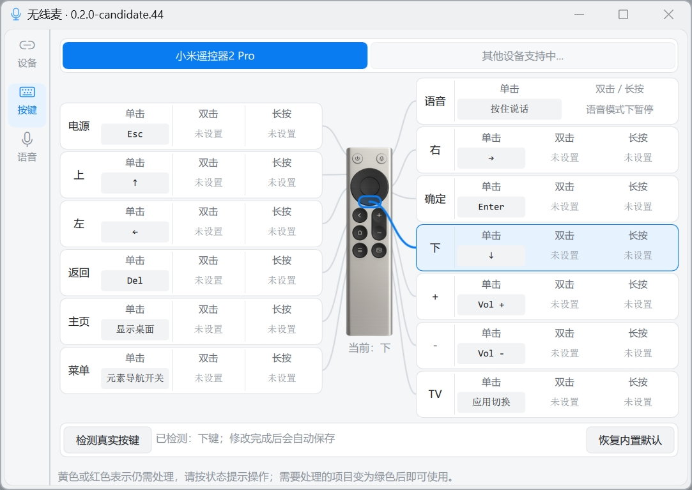
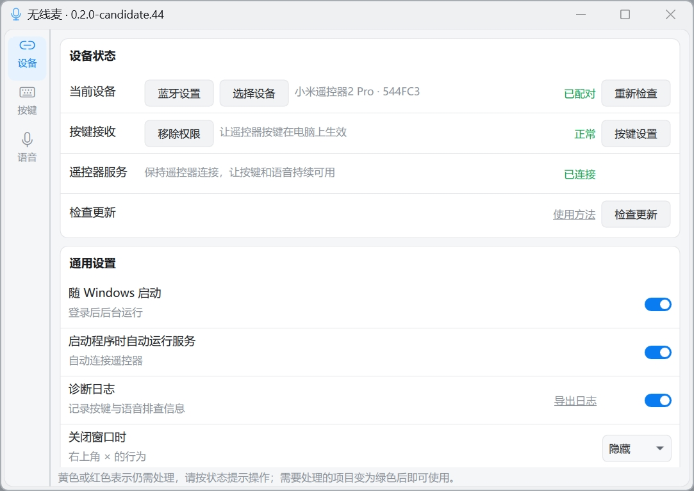
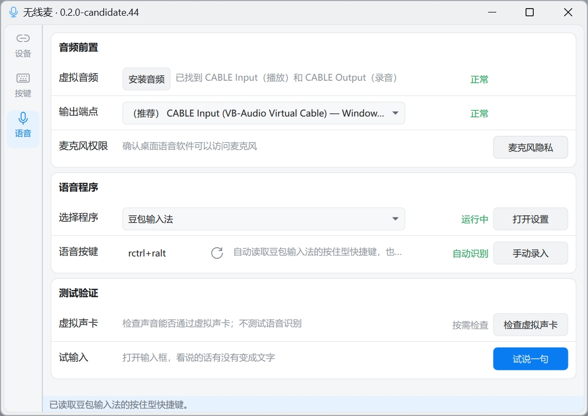

# 无线麦【Win版】

无线麦【Win版】是一款把蓝牙语音遥控器的按键和麦克风变成 Windows 快捷操作与
语音输入的本地桥接工具。目前公开版本首先适配小米蓝牙语音遥控器 2 Pro
（RC003），可用于远距离控制应用、输入文字，以及触发键盘快捷键、系统操作和
Quicker 动作。支持单击、双击、长按和组合按键映射，按住说话、输入法语音。
设备连接、按键处理和音频桥接由本机完成；语音识别是否联网取决于所选输入法
或应用。



## 用来做什么

- 把遥控器变成电脑的远程控制器，不用一直拿着键盘和鼠标；
- 在可编辑的文字区域按住遥控器话筒键说话，通过已配置的输入法输入文字；
- 把实体按键设为方向、确认、返回、音量、窗口和其它 Windows 操作；
- 电脑已安装 Quicker 时，用遥控器触发自己已有的 Quicker 动作；
- 在演示、远程控制、客厅电脑或离电脑较远的场景中完成常用操作。

## 主要特点

- **按键可以自己定义**：当前适配器支持 13 个实体按键，并区分单击、双击、
  长按和遥控器组合动作；
- **支持按住说话**：按下话筒键开始传声，松开结束，适合输入法和其它语音程序；
- **支持快捷键、系统操作和 Quicker**：普通按键、组合键、常用 Windows 动作和
  Quicker 动作可以混合设置；
- **设置和测试集中在一个窗口**：设备、按键、语音分成三个页面，并提供按键检测、
  音频通道测试和实际说话验证；
- **可以后台运行**：支持通知区域、随 Windows 启动、程序打开后自动启动桥接和
  正常停止退出；
- **本机处理**：无线麦本身不上传遥控器地址、按键记录、录音或个人数据。

## 当前支持

### 遥控器

当前公开版本首先适配 **小米蓝牙语音遥控器 2 Pro（RC003）**。无线麦的产品定位
不限定为这一款设备；其它遥控器只有在完成真实连接、按键和语音测试后，才会列入
正式支持范围。

### 语音输入

- **搜狗语音输入**：内置识别，可读取和同步按住说话快捷键；
- **微信输入法**：内置识别并可打开设置，快捷键需要在微信输入法和无线麦中保持一致；
- **Windows 语音输入**：使用系统 `Win+H`；
- **其它输入法或语音程序**：可通过“自定义程序”和自定义快捷键接入，豆包等目前
  归入这一类，是否可用以实际快捷键、麦克风输入和文字上屏测试为准。

后续输入法会按真实安装、快捷键、音频输入和文字上屏结果逐个增加内置适配；没有
完成验证的输入法不会笼统写成“已支持”。

## 下载与安装

当前预发行版：
[无线麦【Win版】｜小米遥控器 2 Pro｜2026-09-01 候选版](https://github.com/ZSTDJan/windows-remote-mic-app/releases/tag/v0.2.0-windows-rc003-candidate.2)

> **运行时需要管理员权限。** 安装程序本身不需要管理员权限，但安装完成后或解压
> 便携版后，请右键无线麦并选择“以管理员身份运行”。否则程序可以打开，语音和部分
> 按键也可能可用，但返回、音量等实体按键可能无法完整识别。当前“随 Windows 启动”
> 使用普通权限；需要完整按键时，请退出普通权限实例后再以管理员身份打开。

从 Release 页面下载一种即可：

| 下载类型 | 当前文件 | 怎么使用 |
| --- | --- | --- |
| 安装版 | `RemoteMicRC003Setup-0.2.0-candidate.2-unsigned.exe` | 推荐；运行安装程序后，从开始菜单或桌面打开“无线麦” |
| 便携版 | `RemoteMicRC003-0.2.0-candidate.2-portable-unsigned.zip` | 免安装；完整解压后运行 `RemoteMicRC003.exe` |

当前候选版没有代码签名，Windows SmartScreen 可能显示安全提示。请只从本仓库
Release 下载，并同时使用 `SHA256SUMS.txt` 核对文件哈希。

## 第一次使用

1. 下载并安装无线麦；使用便携版时，先完整解压 ZIP；
2. 打开 Windows 蓝牙设置，把小米蓝牙语音遥控器 2 Pro 与电脑配对；
3. 右键无线麦的开始菜单、桌面快捷方式或 `RemoteMicRC003.exe`，选择“以管理员身份运行”；
4. 在“设备”页点击“重新检查”，确认设备和按键接收显示正常；
5. 进入“语音”页，按页面提示安装或检查虚拟音频并点击“应用”；在使用的输入法中，
   把麦克风输入设为 `CABLE Output`；
6. 选择语音程序并设置按住说话快捷键。微信输入法需要手动确认两边快捷键一致；
7. 进入“按键”页设置单击、双击、长按、组合键、系统操作或 Quicker 动作，然后保存；
8. 回到“设备”页点击“启动桥接”，先测试普通按键，再在可编辑文本框中按住话筒键
   说一句话，确认松手后文字正常上屏。

详细的配对、虚拟音频、输入法设置、故障排查和哈希校验见
[`apps/windows/rc003/README.md`](apps/windows/rc003/README.md)。

## 界面一览

| 设备与运行状态 | 语音输入设置 |
| --- | --- |
|  |  |

截图来自 Windows 11 上的当前版本。状态文字、系统主题和分辨率会随实际环境变化。

<details>
<summary>开发、技术与仓库信息</summary>

### 技术实现

- WinRT BLE 连接与 ATVV 语音解码；
- Windows Raw Input 与可选 Frida HID 旁路按键监听；
- SendInput 按键映射、用户明确选择的音频输出端点；
- PySide6/Qt Quick 设置界面、通知区域和分项诊断；
- PyInstaller 便携构建与 Inno Setup 安装器。

Windows 客户端位于 [`apps/windows/rc003`](apps/windows/rc003/README.md)。元素导航
的独立项目 **OrthoFocus** 位于
[`apps/windows/orthofocus`](apps/windows/orthofocus/README.md)。

### 从源码本地运行

在 Windows PowerShell 中执行：

```powershell
Set-Location apps/windows/rc003
python -m venv .venv
.\.venv\Scripts\python.exe -m pip install -r requirements-dev.txt
$env:PYTHONPATH = Join-Path (Get-Location) 'src'
.\.venv\Scripts\python.exe -m ovb_rc003 --settings
```

运行桥接：

```powershell
.\.venv\Scripts\python.exe -m ovb_rc003 --bridge
```

运行测试：

```powershell
.\.venv\Scripts\python.exe -m unittest discover -s tests -t . -p 'test_*.py' -v
```

构建未签名候选版：

```powershell
.\build\build-candidate.ps1
```

### 来源与维护边界

- Windows 实现参考了
  [`nijez/open-voice-bridge`](https://github.com/nijez/open-voice-bridge)；
- RC003 HID 旁路参考了
  [`xxb26553663-star/remote-bridge-hub`](https://github.com/xxb26553663-star/remote-bridge-hub)；
- Windows CI 位于 `.github/workflows/windows-rc003-ci.yml`；
- 详细改动和第三方边界见
  [`apps/windows/rc003/ATTRIBUTION.md`](apps/windows/rc003/ATTRIBUTION.md)、
  [`COPYRIGHT.md`](COPYRIGHT.md) 和
  [`THIRD_PARTY_NOTICES.md`](THIRD_PARTY_NOTICES.md)。

</details>

## 开源、反馈与安全

代码按 `GPL-3.0-only` 发布，完整许可证见 [`LICENSE.md`](LICENSE.md)。第三方组件
和素材仍按各自许可与授权记录分发：

- **项目来源**：本仓库从 [`HD838A/remote-mic-app`](https://github.com/HD838A/remote-mic-app)
  的 Windows RC003 工作继续整理；macOS/Swift 内容不在本仓库维护；
- 普通问题和修改建议见 [`CONTRIBUTING.md`](CONTRIBUTING.md)；
- 安全漏洞请按 [`SECURITY.md`](SECURITY.md) 使用私密入口，不要公开复现细节；
- 第三方许可与素材授权见 [`THIRD_PARTY_LICENSES`](THIRD_PARTY_LICENSES/README.md)、
  [`THIRD_PARTY_SOURCE.md`](THIRD_PARTY_SOURCE.md) 和
  [`ASSET_LICENSES.md`](ASSET_LICENSES.md)。
