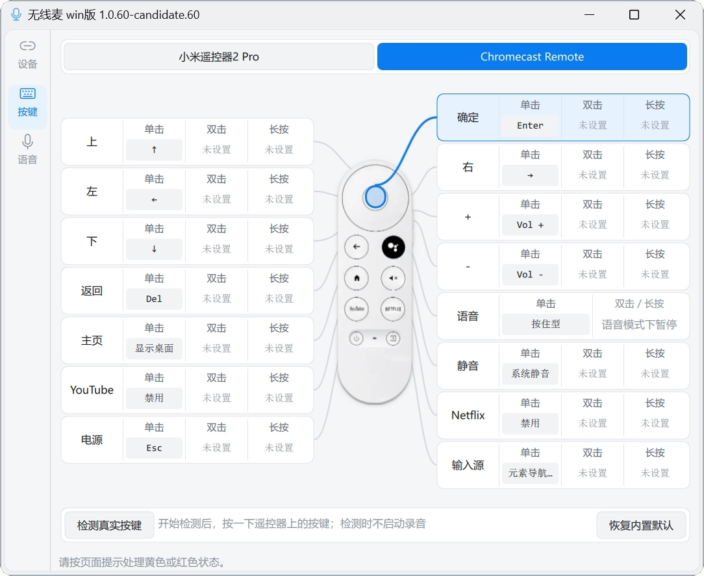
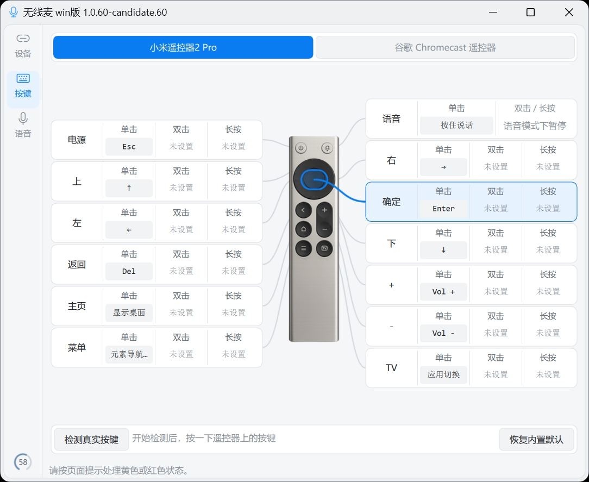
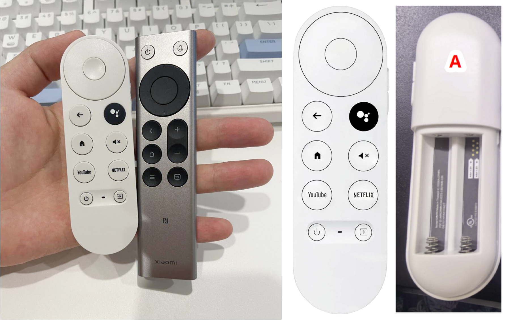
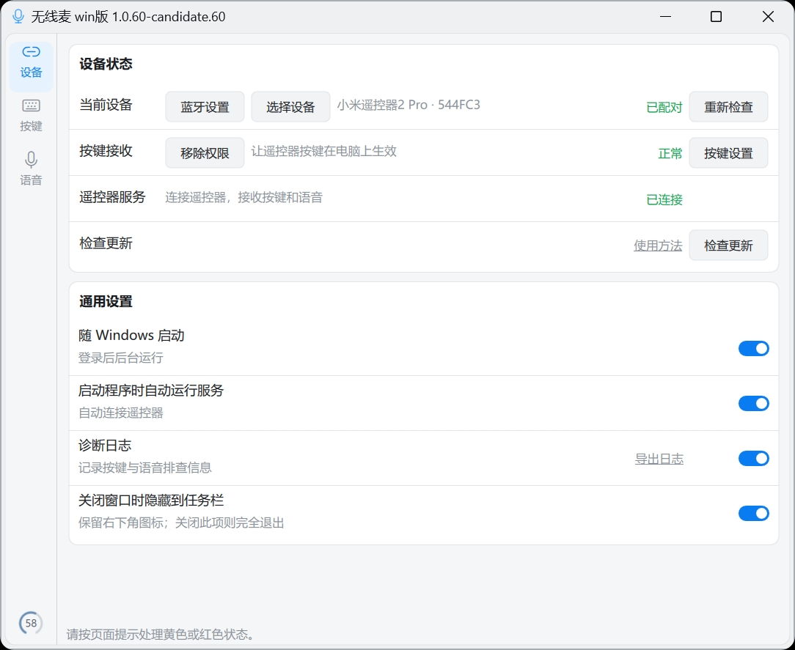
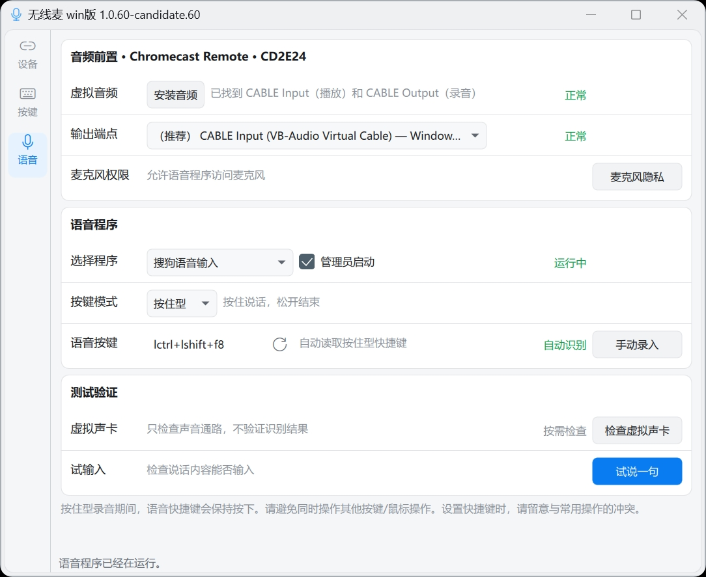

# 无线麦【Win版】

无线麦把蓝牙语音遥控器的按键和麦克风变成 Windows 快捷操作与语音输入工具，可远距离控制应用、输入文字和触发 Quicker 动作。支持按键单击、双击、长按映射，适配小米蓝牙语音遥控器 2 Pro 和谷歌 TV Chromecast 遥控器，可配合搜狗、微信、豆包输入法使用。QQ 群：89641716。

| 谷歌遥控器按键映射 | 小米遥控器按键映射 |
| --- | --- |
|  |  |



<sub>设备参考：小米遥控器约 65–99 元，Type-C 充电；录音仅支持按住型，单次限 60 秒内。图示谷歌遥控器约 15 元，支持按住型和开关型；后续版本的开关型可录制超过 60 秒，最长可设 10 分钟，实际时长也受语音软件限制。谷歌遥控器版本较多，图示款购自某多多平台「IN数码配件」，仅作型号参考，无利益关联；价格以购买时为准。</sub>

## 下载与版本

**[下载 Windows 免安装版](https://github.com/ZSTDJan/windows-remote-mic-app/releases/download/v1.0.44/RemoteMicRC003-1.0.44-portable-unsigned.zip)** · [版本说明](https://github.com/ZSTDJan/windows-remote-mic-app/releases/tag/v1.0.44) · [校验文件](https://github.com/ZSTDJan/windows-remote-mic-app/releases/download/v1.0.44/SHA256SUMS.txt)

当前公开下载的是 **1.0.44**，支持小米遥控器。谷歌遥控器已加入后续版本并在测试，**上面的公开下载包暂不支持谷歌遥控器**。页面截图来自后续版本，具体界面以安装的版本为准。

完整解压 ZIP 后运行 `RemoteMicRC003.exe`，不要只取出 EXE。程序未签名，Windows 可能弹出安全提示；请从本仓库下载。

## 能做什么

- 给遥控器按键设置方向、确认、音量、快捷键、鼠标操作或 Quicker 动作；同一按键可分别设置单击、双击和长按。
- 用遥控器话筒键说话，在文字输入框中使用搜狗、微信或豆包输入法输入文字。
- 在通知区域保持运行；关闭设置窗口通常会隐藏，结束程序请从通知区域选择“完全退出”。

## 第一次使用

### 先让遥控器按键可用

1. 在 Windows 蓝牙设置中配对遥控器，再打开无线麦。
2. 在“设备”页点“选择设备”，选中刚配对的遥控器并点“使用此设备”；然后点“启动服务”。按页面提示处理未就绪的项目，直到显示已连接。
3. 按一次方向键确认能控制电脑。要改按键动作，到“按键”页选择按键，设置单击、双击或长按动作，点“完成”即保存。

### 再设置语音输入

1. 在“语音”页安装音频组件。无线麦的输出端点选 `CABLE Input`，输入法的麦克风选 `CABLE Output`。
2. 选择搜狗、微信或豆包输入法，核对无线麦“语音按键”与输入法对应模式的快捷键一致；自动读取失败时可手动录入。小米使用按住型；后续版本的谷歌还可选择开关型。
3. 先在记事本中用电脑键盘试这个快捷键，确认能打开语音输入。再把光标留在文字框里试遥控器：按住型是按住说话、松开结束；开关型是按一次开始、再按一次结束。

**快捷键注意：**避开 Windows 和其他软件正在使用的组合键。按住说话期间，这组快捷键会一直保持按下，松开话筒键才释放；这段时间不要同时操作其他键或鼠标。

首次配对、音频安装和故障排查的详细步骤见 [使用说明](apps/windows/rc003/README.md)。

## 界面介绍

| 1. 设备：选择遥控器、查看连接状态 | 2. 谷歌按键映射：设置单击、双击、长按 |
| --- | --- |
|  |  |
| 3. 小米按键映射：设置单击、双击、长按 | 4. 语音：选择输入法和快捷键 |
|  |  |

## 交流与反馈

无线麦 QQ 群：**89641716**


<details>
<summary>开发与技术资料</summary>

Windows 客户端的运行、构建和技术说明见 [开发者文档](apps/windows/rc003/README.md)。
元素导航的独立项目 OrthoFocus 见 [项目说明](apps/windows/orthofocus/README.md)。

从源码运行设置界面：

```powershell
Set-Location apps/windows/rc003
py -3.12 -m venv .venv
.\.venv\Scripts\python.exe -m pip install -r requirements-dev.txt
$env:PYTHONPATH = Join-Path (Get-Location) 'src'
.\.venv\Scripts\python.exe -m ovb_rc003 --settings
```

</details>

## 开源与安全

代码按 [GPL-3.0-only](LICENSE.md) 发布；第三方组件和素材按各自的许可与授权使用，见 [第三方说明](THIRD_PARTY_LICENSES/README.md) 和 [素材授权](ASSET_LICENSES.md)。普通问题与建议见 [参与说明](CONTRIBUTING.md)，安全漏洞请通过 [私密报告入口](SECURITY.md) 提交。
