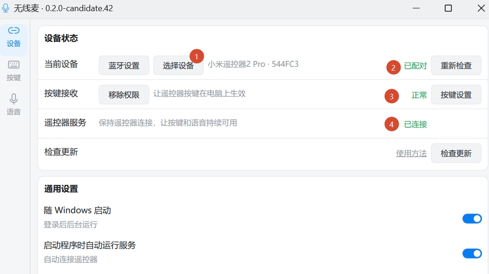
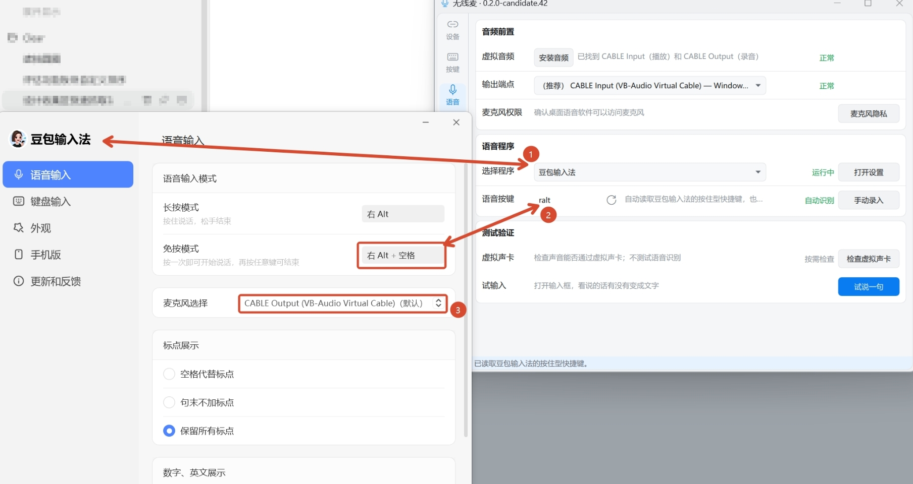

# 无线麦【Win版】

无线麦【Win版】是一款独立维护的 Windows 遥控与语音输入工具，
把蓝牙语音遥控器的按键和麦克风转成电脑上的快捷操作与语音输入。
目前公开版本首先适配小米蓝牙语音遥控器 2 Pro
（RC003），可用于远距离控制应用、输入文字，以及触发键盘快捷键、系统操作和
Quicker 动作。支持单击、双击、长按和组合按键映射，按住说话、输入法语音。
设备连接、按键处理和音频桥接由本机完成；语音识别是否联网取决于所选输入法
或应用。

## 下载无线麦

**[下载 Windows 免安装版 · 解压后运行](https://github.com/ZSTDJan/windows-remote-mic-app/releases/download/v0.2.0-windows-rc003-candidate.2/RemoteMicRC003-0.2.0-candidate.2-portable-unsigned.zip)**

当前公开版本：**0.2.0-candidate.2（测试版）**。完整解压 ZIP 后，运行文件夹中的
`RemoteMicRC003.exe`；不要只把 EXE 单独取出来。

[版本说明与历史附件](https://github.com/ZSTDJan/windows-remote-mic-app/releases/tag/v0.2.0-windows-rc003-candidate.2) · [校验文件 SHA256SUMS.txt](https://github.com/ZSTDJan/windows-remote-mic-app/releases/download/v0.2.0-windows-rc003-candidate.2/SHA256SUMS.txt)

后续版本暂不提供安装程序，新用户请选择免安装版。旧版附件保留供历史使用与回退，
旧文件名和下载链接不变；新中文文件名从下一次发布开始使用，产品仍是无线麦。

当前测试版未签名，Windows SmartScreen 可能提示。请只从本仓库下载，
并用 `SHA256SUMS.txt` 核对文件哈希。


## 用来做什么

- 把遥控器变成电脑的远程控制器，不用一直拿着键盘和鼠标；
- 在可编辑的文字区域按住遥控器话筒键说话，通过已配置的输入法输入文字；
- 把实体按键设为方向、确认、返回、音量、窗口和其它 Windows 操作；
- 电脑已安装 Quicker 时，用遥控器触发自己已有的 Quicker 动作；
- 在演示、远程控制、客厅电脑或离电脑较远的场景中完成常用操作。

## 主要特点

- **按键可以自己定义**：当前适配器支持 13 个实体按键，并区分单击、双击、
  长按和遥控器组合动作；
- **支持按住说话**：按下话筒键开始传声，松开结束，适合输入法和其它语音程序；
- **支持快捷键、系统操作和 Quicker**：普通按键、组合键、常用 Windows 动作和
  Quicker 动作可以混合设置；
- **设置和测试集中在一个窗口**：设备、按键、语音分成三个页面，并提供按键检测、
  音频通道测试和实际说话验证；
- **可以后台运行**：支持通知区域、随 Windows 启动、程序打开后自动启动遥控器服务和
  正常停止退出；
- **本机处理**：无线麦本身不上传遥控器地址、按键记录、录音或个人数据。

## 当前支持

### 遥控器

当前公开版本首先适配 **小米蓝牙语音遥控器 2 Pro（RC003）**。无线麦的产品定位
不限定为这一款设备；其它遥控器只有在完成真实连接、按键和语音测试后，才会列入
正式支持范围。

### 语音输入

- **搜狗语音输入**：支持按住说话，可读取和同步语音快捷键；
- **微信输入法**：支持语音输入，需确认输入法和无线麦的语音快捷键一致；
- **豆包输入法**：支持按住说话，将语音转换为文字输入。

当前公开测试版的豆包需通过“自定义程序”接入；内置豆包适配已在开发版本中加入，
尚未包含在上方下载的 `0.2.0-candidate.2` 中。

## 第一次使用

1. 下载免安装 ZIP，完整解压，再运行 `RemoteMicRC003.exe`。出现 Windows UAC 提示时，
   点“是”。
2. 打开 Windows 蓝牙设置，配对小米蓝牙语音遥控器 2 Pro。
3. 打开无线麦“设备”页，选择刚配对的遥控器，再点“重新检查”。“已配对”“正常”
   “已连接”全部变绿后，按键映射就可以使用。



4. 打开“按键”页，给需要的按键选择动作。点“完成”后会自动保存，不用再找保存按钮。
5. 需要语音输入时，打开“语音”页，先点“安装音频”，按提示完成虚拟音频安装。
6. 无线麦的输出端点选择 `CABLE Input (VB-Audio Virtual Cable)`，语音程序选择
   搜狗语音输入、微信输入法或豆包输入法。
7. 打开所选输入法的语音设置，把麦克风设为
   `CABLE Output (VB-Audio Virtual Cable)`。把输入法的长按型语音快捷键设成与
   无线麦“语音按键”完全相同。



8. 回到“设备”页点“启动服务”。先试普通按键，再在文字输入框中按住话筒键说话，
   松开后确认文字正常出现。

详细的配对、虚拟音频、输入法设置、故障排查和哈希校验见
[`apps/windows/rc003/README.md`](apps/windows/rc003/README.md)。

## 使用限制与风险

- 程序在按键接收等功能需要更高权限时，会按需启动管理员助手，并由 Windows 弹出
  UAC 让用户确认；它不能绕过系统静默取得管理员权限。当前公开版本如果以普通权限
  运行仍有异常，可再右键程序或快捷方式，选择“以管理员身份运行”。
- 在设有限制的公司电脑、内网电脑或受管设备上，管理员提权、虚拟音频安装、按键注入、
  界面元素识别或访问 GitHub 可能被安全策略拦截，相关功能可能无法使用。
- 按键控制、模拟输入、HID 监听和界面元素识别等能力，可能被游戏或反作弊软件识别为
  自动化或违规操作。请勿在无法确认规则的游戏环境中使用，并根据游戏规定自行判断账号风险。

## 界面一览

| 设备与运行状态 | 语音输入设置 |
| --- | --- |
|  |  |

## 交流与反馈

**无线麦 QQ 群：89641716**


<details>
<summary>开发、技术与仓库信息</summary>

### 技术实现

- WinRT BLE 连接与 ATVV 语音解码；
- Windows Raw Input 与可选 Frida HID 旁路按键监听；
- SendInput 按键映射、用户明确选择的音频输出端点；
- PySide6/Qt Quick 设置界面、通知区域和分项诊断；
- PyInstaller 免安装构建与 Windows CI 发布封装。

Windows 客户端位于 [`apps/windows/rc003`](apps/windows/rc003/README.md)。元素导航
的独立项目 **OrthoFocus** 位于
[`apps/windows/orthofocus`](apps/windows/orthofocus/README.md)。

### 从源码本地运行

在 Windows PowerShell 中执行：

```powershell
Set-Location apps/windows/rc003
py -3.12 -m venv .venv
.\.venv\Scripts\python.exe -m pip install -r requirements-dev.txt
$env:PYTHONPATH = Join-Path (Get-Location) 'src'
.\.venv\Scripts\python.exe -m ovb_rc003 --settings
```

运行桥接：

```powershell
.\.venv\Scripts\python.exe -m ovb_rc003 --bridge
```

运行测试：

```powershell
.\.venv\Scripts\python.exe -m unittest discover -s tests -t . -p 'test_*.py' -v
```

构建未签名候选版：

```powershell
.\build\build-candidate.ps1
```

### 维护与第三方说明

- Windows CI 位于 `.github/workflows/windows-rc003-ci.yml`；
- 详细改动和第三方边界见
  [`apps/windows/rc003/ATTRIBUTION.md`](apps/windows/rc003/ATTRIBUTION.md)、
  [`COPYRIGHT.md`](COPYRIGHT.md) 和
  [`THIRD_PARTY_NOTICES.md`](THIRD_PARTY_NOTICES.md)。

</details>

## 开源、反馈与安全

代码按 `GPL-3.0-only` 发布，完整许可证见 [`LICENSE.md`](LICENSE.md)。第三方组件
和素材仍按各自许可与授权记录分发：

- 普通问题和修改建议见 [`CONTRIBUTING.md`](CONTRIBUTING.md)；
- 安全漏洞请按 [`SECURITY.md`](SECURITY.md) 使用私密入口，不要公开复现细节；
- 第三方许可与素材授权见 [`THIRD_PARTY_LICENSES`](THIRD_PARTY_LICENSES/README.md)、
  [`THIRD_PARTY_SOURCE.md`](THIRD_PARTY_SOURCE.md) 和
  [`ASSET_LICENSES.md`](ASSET_LICENSES.md)。
