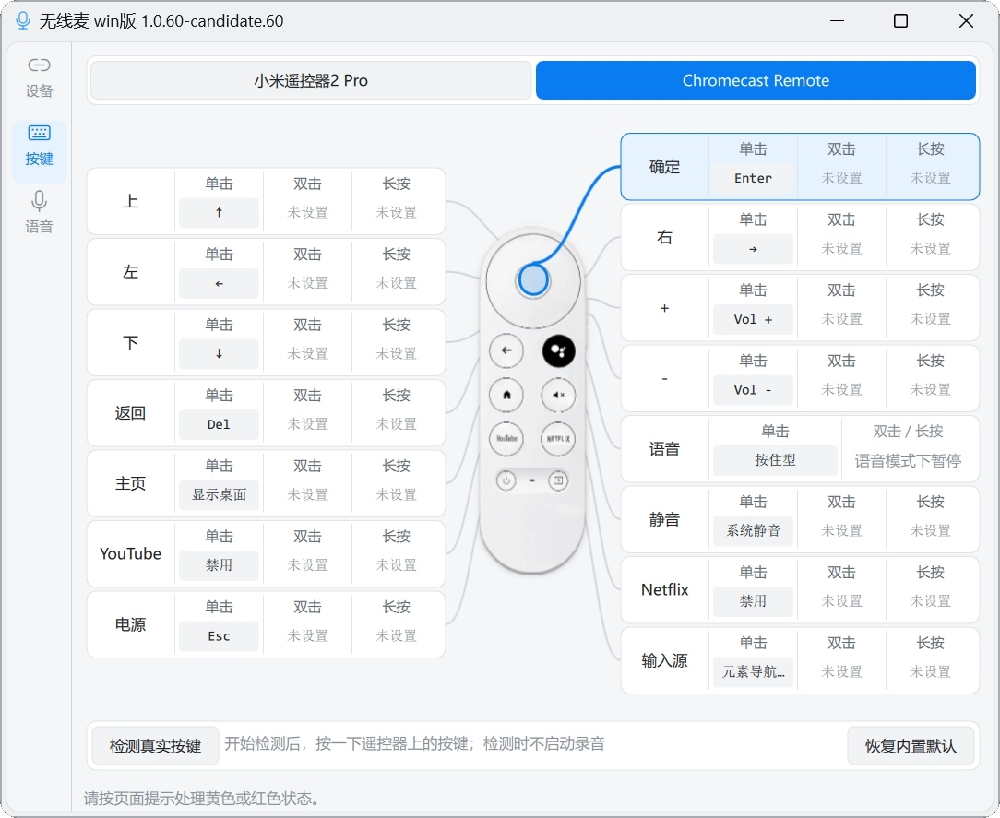
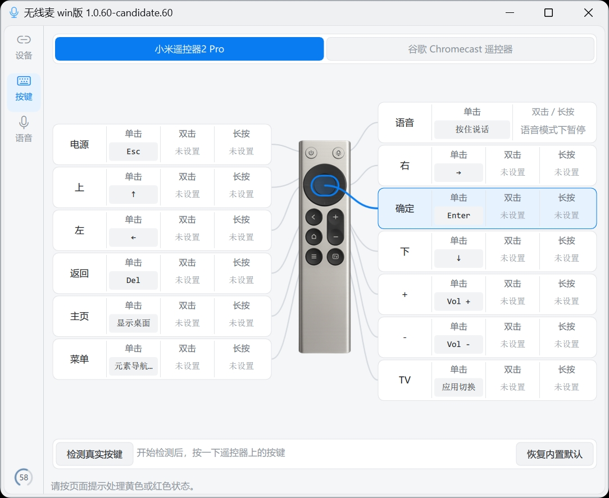
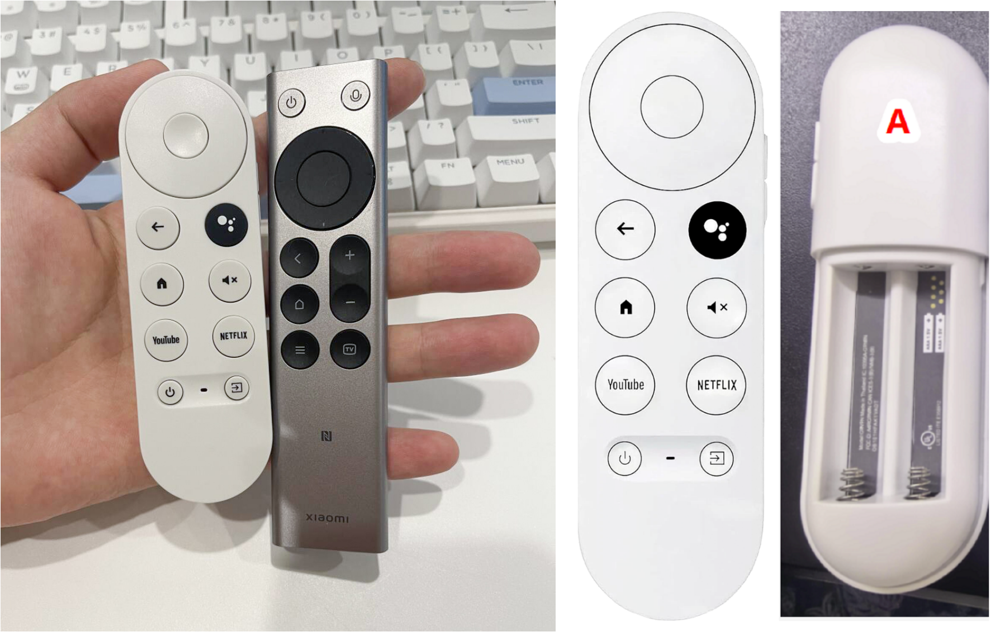
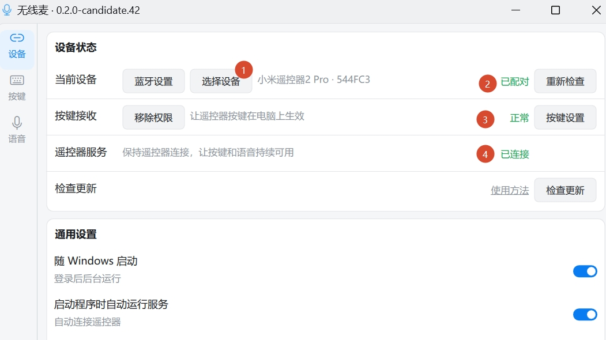
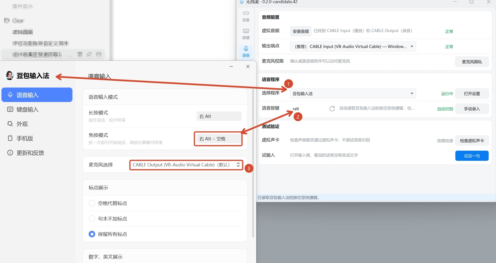
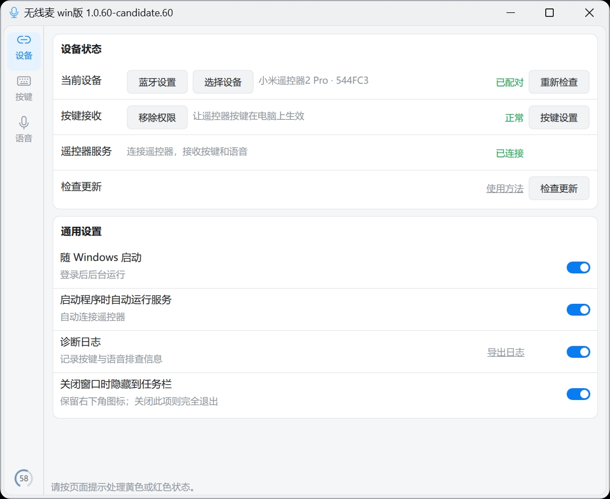
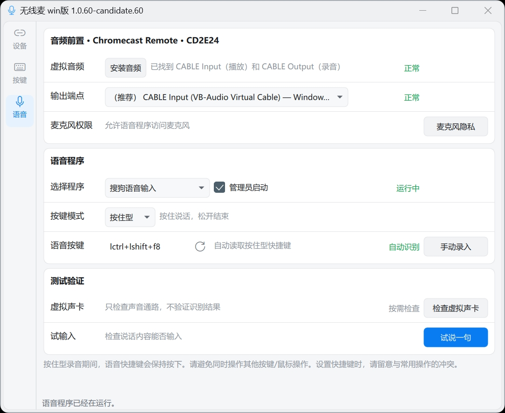

# 无线麦【Win版】

无线麦把蓝牙语音遥控器的按键和麦克风变成 Windows 快捷操作与语音输入工具，可远距离控制应用、输入文字和触发 Quicker 动作。

支持按键单击、双击、长按映射，适配小米遥控器2 Pro 和图示谷歌 Chromecast 遥控器，可配合搜狗、微信、豆包和 Chatterfly 使用。QQ 群：89641716。

| 谷歌遥控器按键映射 | 小米遥控器按键映射 |
| --- | --- |
|  |  |

设备参考：

- 小米遥控器2 Pro：参考价约 65–99 元，Type-C 充电；仅支持按住型，单次录音限制在 60 秒内。
- 图示谷歌遥控器：参考价约 15 元，支持按住型和开关型；可录制超过 60 秒，开关型可设置自动结束时长。
- 谷歌遥控器版本较多，购买前请核对电池仓内的型号信息；其它版本的兼容性不能仅凭外观判断。
- 图示谷歌款购自某多多平台「IN数码配件」，仅作型号参考，无利益关联。

## 下载与版本

**[下载正式版 1.0.95](https://github.com/ZSTDJan/windows-remote-mic-app/releases/download/v1.0.95/RemoteMicRC003-1.0.95-portable-unsigned.zip)** · [版本说明](https://github.com/ZSTDJan/windows-remote-mic-app/releases/tag/v1.0.95) · [SHA256SUMS.txt](https://github.com/ZSTDJan/windows-remote-mic-app/releases/download/v1.0.95/SHA256SUMS.txt)

当前正式版为 **1.0.95**，本版主要变化：

- 修复按键页在部分窗口宽度和缩放下的右侧卡片边框裁切。
- 增加语音资源清理失败后的启动保护。触发保护时，同一次运行中不能再次启动服务，需从通知区域完全退出后重新打开。
- 补全小米遥控器连接失败的诊断日志，用于排查原因；原连接和重试规则保持不变。

**仍在排查：** 持续显示“点击重新连接”、豆包首次语音启动偶发异常，以及 Chatterfly 有录音气泡但不上屏的部分反馈，尚未确认解决。

旧版可在 [历史版本](https://github.com/ZSTDJan/windows-remote-mic-app/releases) 中下载。

完整解压 ZIP 后运行其中的 `无线麦 win版 <版本号>.exe`，不要只取出 EXE。程序未签名，Windows 可能弹出安全提示；请从本仓库下载。

## 能做什么

- 给遥控器按键设置方向、确认、音量、快捷键、鼠标操作或 Quicker 动作；同一按键可分别设置单击、双击和长按。
- 用遥控器话筒键说话，在文字输入框中使用搜狗、微信、豆包或 Chatterfly 输入文字。
- 在“管理按键配置”中复制、应用、重命名和删除配置副本，或导出／导入文件备份；当前映射始终自动保存。
- 在通知区域保持运行；关闭设置窗口通常会隐藏，结束程序请从通知区域选择“完全退出”。

## 第一次使用

- **系统兼容性：** 开发环境为 Windows 11 23H2。较早 Windows 版本的兼容性尚未全面验证，不能仅凭系统版本判断连接或语音故障的原因。
- **首次配置前，请先暂时退出 360 等杀毒软件；配置和测试完成后及时恢复防护。**
- **首次使用语音前，必须先安装虚拟音频组件 VB-CABLE，并重启电脑；重启后再配置语音。**

### 先让遥控器按键可用

1. 在 Windows 蓝牙设置中配对遥控器。
2. 打开无线麦，进入“设备”页。
3. 点“选择设备”，选中刚配对的遥控器并点“使用此设备”。
4. 点“启动服务”，查看连接状态；如有未就绪提示，按页面说明处理。
5. 连接后按一次方向键，确认能控制电脑。

需要自定义按键时：

1. 到“按键”页选择要修改的按键。
2. 设置该按键的单击、双击或长按动作。
3. 点“完成”保存。

设备教程图来自旧版界面；新版按钮位置可能略有变化，操作顺序相同。

### 再设置语音输入

**语音需要在无线麦和对应输入法两边分别配置，只设置无线麦还不够。**

先完成基础设置：

1. 在“语音”页点击“安装音频”，安装虚拟音频组件 VB-CABLE，**安装完成后先重启电脑**。
2. 重启后，在无线麦“语音”页选择搜狗、微信、豆包或 Chatterfly。
3. 在无线麦中，把“输出端点”设为 `CABLE Input`。
4. 打开对应输入法或 Chatterfly 的设置，把麦克风设为 `CABLE Output`。
5. 在无线麦中确认“按键模式”：小米只支持按住型，谷歌还支持开关型。

**搜狗、微信和豆包还需要配置语音快捷键：**

1. 在输入法设置中，为所选语音模式设置快捷键。
2. 让无线麦的“语音按键”与输入法中的设置一致；自动读取失败可手动录入。
3. 打开记事本，把光标放在文字框里，用电脑键盘测试该快捷键，确认能录音和输入文字。

**Chatterfly：**

- 麦克风仍需按上面的基础设置选择 `CABLE Output`。
- 无线麦直接控制录音，无需靠快捷键启动；界面中的快捷键供键盘对照。

最后，把光标放在文字框里，用遥控器话筒键测试：

- 按住型：按住说话，松开结束。
- 开关型：按一次开始，再按一次结束。

语音教程图以豆包输入法为例，重点是两边快捷键一致，并在输入法中选择 `CABLE Output`；新版界面位置可能略有变化。

快捷键注意（搜狗、微信和豆包）：

- 避开 Windows 和其它软件已占用的组合键。
- 按住型录音期间，语音快捷键会保持按下，松开话筒键才释放。

首次配对、音频安装和故障排查的详细步骤见 [使用说明](apps/windows/rc003/README.md)。

## 界面介绍

| 1. 设备：选择遥控器、查看连接状态 | 2. 谷歌按键映射：设置单击、双击、长按 |
| --- | --- |
|  |  |
| 3. 小米按键映射：设置单击、双击、长按 | 4. 语音：选择输入法和快捷键 |
|  |  |

## 交流与反馈

无线麦 QQ 群：**89641716**

开发与技术资料

Windows 客户端的运行、构建和技术说明见 [开发者文档](apps/windows/rc003/README.md)。
元素导航的独立项目 OrthoFocus 见 [项目说明](apps/windows/orthofocus/README.md)。

## 开源与安全

代码按 [GPL-3.0-only](LICENSE.md) 发布；第三方组件和素材按各自的许可与授权使用，见 [第三方说明](THIRD_PARTY_LICENSES/README.md) 和 [素材授权](ASSET_LICENSES.md)。普通问题与建议见 [参与说明](CONTRIBUTING.md)，安全漏洞请通过 [私密报告入口](SECURITY.md) 提交。
