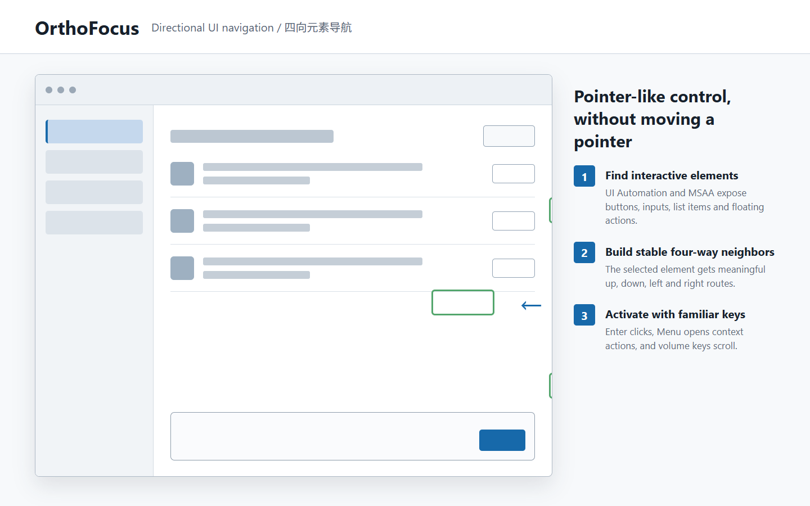
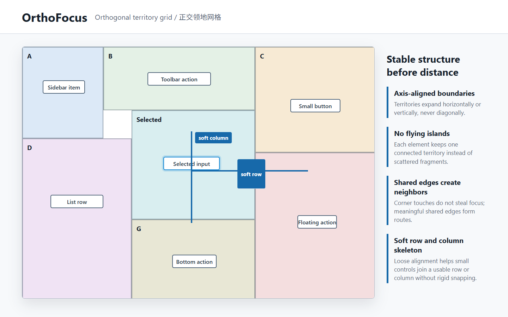

# OrthoFocus

**基于正交领地网格与软行列骨架的 Windows 四向元素导航。**

OrthoFocus 把方向键、数字键盘或遥控器方向键变成接近鼠标点击的界面控制方式。
它通过 Windows UI Automation、MSAA 和窗口几何寻找可互动元素，再把散乱控件整理成
横平竖直的导航关系，让用户可以用上下左右到达按钮、输入框、列表项和悬浮操作。



## 与普通空间导航的区别

普通 XY Focus 往往直接比较距离和角度，容易出现斜跳、跳过中间项、细小控件变成孤岛，
或者按上却跑到左上角。OrthoFocus 在距离排序前增加了一层稳定的界面结构：

- **正交领地网格**：领地只横向或纵向扩张，边界用水平线和竖直线切分，不生成飞地。
- **软行列骨架**：散乱的小控件会归入相近的行或列，但不会被强制吸到不合理的位置。
- **投射优先、领地后备**：正前方有目标时先经过它，缺口和不规则布局再由领地邻接补足。
- **细分元素优先**：能识别具体按钮或输入框时，不用无意义的大范围窗口外壳抢占导航。
- **层级可进可退**：父行、文件夹、行内按钮和悬浮操作可以保持各自的互动层级。



## 运行要求

- Windows 10 或 Windows 11。
- Python 3.10 及以上版本。
- 不依赖遥控器、蓝牙、音频设备或 Remote Mic。

## 安装与运行

```powershell
py -3.10 -m venv .venv
.\.venv\Scripts\python.exe -m pip install -e .
.\.venv\Scripts\orthofocus.exe
```

## 操作

- `Ctrl+Alt+N`：进入或退出当前前台窗口的导航。
- 方向键：移动选区。
- `Enter`：点击；连续触发可执行双击。
- 菜单键：右键。
- 音量加减：在当前元素处滚动。
- `PageUp` / `PageDown`：切换同一位置的父级或子级元素。
- `Esc`：返回上一层或退出导航。
- `Ctrl+Alt+Q`：退出程序。

只扫描一次当前窗口：

```powershell
.\.venv\Scripts\orthofocus.exe --scan-only
```

## 测试

```powershell
.\.venv\Scripts\python.exe -m unittest discover -s tests -p "test_*.py"
```

自动测试覆盖空间选路、目标过滤、层级、窗口移动、悬浮元素、缓存和大量随机布局。
不同软件公开的 UI Automation / MSAA 信息并不完全一致，因此真实软件中的可达性、
点击结果和长期运行仍需要人工验证。

## 项目边界

OrthoFocus 只做可互动元素的方向导航和点击，不提供连续鼠标指针移动、自由拖拽、OCR
或图像识别。源码可以独立运行，也被 Remote Mic RC003 作为伴随进程集成使用；两种
用法共享同一份导航算法。

## 许可证

代码按 `GPL-3.0-only` 发布。可以使用、修改和再分发，但分发修改版时仍需遵守 GPL，
并提供对应源码和许可证。
